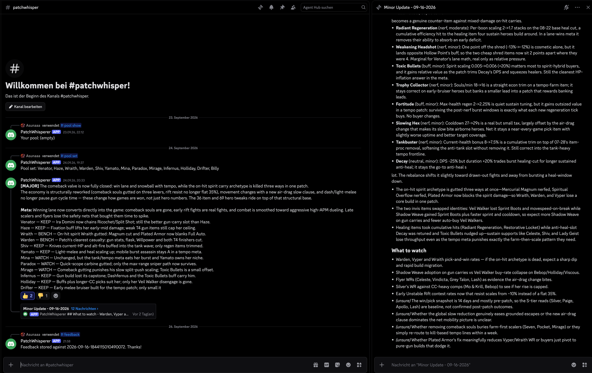
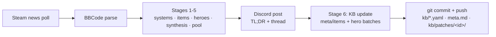

# PatchWhisperer

PatchWhisperer is a Discord bot that reads every Deadlock patch the moment it hits
Steam News, runs a six-stage LLM analysis over it (systems → items → all 38 heroes →
synthesis → your hero pool → knowledge-base update), posts a verdict you can act on
tonight, and commits the whole thing — including its updated memory of the meta — to
git.



## Try it in 30 seconds

```sh
uv sync
uv run pw demo
```

`pw demo` replays the real 2026-09-16 pipeline run from recorded model outputs:
no API key, no network, no Discord. It prints the parsed patch, per-stage summaries,
the exact Discord TL;DR + thread, and the knowledge-base changes on a throwaway copy
of the KB.

## How it works



| Stage | Prompt | Input | Output |
|---|---|---|---|
| 1 | `stage1_systems` | General/systems changes + current meta.md | Which systems moved, tempo direction (tempo vs scaling), effect per archetype |
| 2 | `stage2_items` | Item changes + KB entries for those items and the heroes who build them | Per-item direction/magnitude, affected heroes, build-path shifts |
| 3 | `stage3_heroes` | Hero changes + full KB + 14-day win/pick-rate snapshot | One entry per hero (all 38): direction, magnitude, tier before→after, one-liner |
| 4 | `stage4_synthesis` | Stages 1–3 (movers only) + meta.md | Patch size, headline, meta thesis, winners/losers, non-obvious calls |
| 5 | `stage5_pool` | Synthesis + pool heroes' entries | keep/watch/bench verdict + build adjustment per pool hero |
| 6 | `stage6_kb_update` | Synthesis + movers + items + meta.md + items KB | New meta.md + item_updates + change_log |
| 6h | `stage6_kb_heroes` | Synthesis + items + stage-3 entries and KB entries for a 10-hero batch | Changed-fields-only `hero_updates` for that batch (repeated until all movers covered) |

Stages 1–5 produce the analysis; stage 6 writes the knowledge base. Posting happens
**before** the KB update, so a stage-6 failure can never eat the analysis — the bot
posts the verdict, then reports the KB failure separately and leaves the KB untouched.

### Cost of a real run

From the 09-16-2026 run (~9.5 min total; hidden reasoning tokens dominate output):

| Stage | Output tokens | of which reasoning |
|---|---|---|
| 1 systems | 2,989 | 1,172 |
| 2 items | 8,677 | 4,214 |
| 3 heroes | 23,672 | 18,016 |
| 4 synthesis | 2,892 | 1,479 |
| 5 pool | 7,133 | 5,178 |
| 6 meta+items | 14,153 | 11,383 |
| 6h1–6h4 hero batches | 21,089 / 23,742 / 22,343 / 16,514 | 18,077 / 22,507 / 18,614 / 15,621 |

The model spends most of its output budget on hidden reasoning, which is why
`config.STAGE_MAX_TOKENS` budgets are much larger than the visible JSON it returns.
Stage 6 splits hero updates into 10-hero batches (`config.STAGE6_HERO_BATCH`) and asks
only for fields that actually change — a single 35-mover full-state call blew past
the token limit.

## The knowledge base

`kb/` is the bot's memory, versioned in git and read before every patch:

- `heroes.yaml` — per-hero tier, trend, role, builds, matchups, notes
- `items.yaml` — per-item role, tier, who buys it
- `meta.md` — the current meta thesis: how games are won, archetype standings, watchlist
- `corrections.md` — reader corrections the analyst must respect (edit this to steer it)
- `sources/` — distilled creator transcripts used to seed the KB
- `patches/<patch_id>/` — every run's prompts, raw model output, and parsed JSON

## Discord commands

| Command | What it does |
|---|---|
| `/pool show` | Show your hero pool |
| `/pool set <heroes>` | Replace your pool (comma-separated) |
| `/pool add <hero>` / `/pool remove <hero>` | Adjust your pool |
| `/analyze [patch] [force]` | Analyze a patch now (`gid` or `latest`; `force` re-runs a processed patch). Reports success/failure ephemerally. |
| `/patches` | Recent patch posts with their seen state |
| `/kb hero <name>` | Show a hero's KB entry |
| `/roster` | Provisional new heroes and announced-but-unreleased heroes |
| `/feedback <text>` | Attach feedback to the latest analysis |

👍/👎 reactions on the TL;DR message are recorded as feedback on that patch.

## Patch kinds

Every Steam announcement is classified before analysis: `balance` (patch/hotfix
notes — the normal pipeline), `major` (big content updates like *City Never
Sleeps*, whose real notes live on a JS-rendered playdeadlock.com page — a stage-0
digest turns that page into patch-note lines first), `hero_release` (a new hero
announcement — no patch analysis; roster sync handles it), and `other` (ignored).
For a major update you can drop hand-written notes at
`kb/patches/<patch_id>/notes.md` (or pass `--notes` to `pw analyze`) to skip the
page fetch, and `pw analyze --sources` feeds post-patch creator takes from
`kb/sources/` into stages 1/3/4 as corroboration (the automatic bot run never
injects sources — it must stand alone).

## New heroes

Roster sync watches the live hero roster for names missing from `kb/heroes.yaml`.
A new hero triggers a day-0 evaluation — kit text, base stats, popular items and
a few days of (deliberately distrusted) ranked stats go into a `new_hero` stage —
which writes a provisional KB entry (`provisional: true`, `released_on`) and posts
a day-0 card to Discord. Seven days after release the hero is automatically
re-evaluated with real usage/counter data via the `enrich` path, `provisional`
flips to false, and a check-in card posts the tier movement. The bot runs roster
sync hourly in the poll loop and immediately on hero-release posts; `/roster`
lists provisional and announced-but-unreleased heroes.

Failure behavior: a new patch that fails analysis is retried on subsequent polls up
to 3 attempts, then marked `skipped`. A patch whose analysis succeeds but whose
stage-6 KB update fails still posts the analysis and reports the KB failure as a
separate message.

## Configuration

All via `.env` (see `.env.example`):

| Variable | Default | Purpose |
|---|---|---|
| `DISCORD_TOKEN` | — | Bot token (required for `pw bot`) |
| `DISCORD_GUILD_ID` | `0` | Guild to sync slash commands to |
| `DISCORD_CHANNEL_ID` | `0` | Channel the bot posts to |
| `CMDC_API_KEY` | — | LLM provider key |
| `LLM_BASE_URL` | `https://api.commandcode.ai/provider/v1` | OpenAI-compatible endpoint |
| `LLM_MODEL` | `deepseek/deepseek-v4-flash` (`.env.example`: `deepseek/deepseek-v4.1-flash`) | Model for all stages |
| `DEFAULT_POOL` | empty (`.env.example`: `Wraith,Warden`) | Pool for `pw analyze` when `--pool` isn't given |
| `STATE_DB` | `./state.db` | SQLite seen/posts/feedback DB |
| `POLL_INTERVAL_S` | `300` | Steam news poll interval |
| `HEALTHCHECK_URL` | — | Pinged after each poll iteration |

## Deploy (always-on host)

The bot is designed to run on exactly one always-on machine (e.g. a Mac mini) with
the git repo as the single source of truth:

```sh
git clone <repo-url> && cd PatchWhisperer
uv sync
# copy .env and state.db onto the host — both are gitignored
./launchd/install.sh     # launchd keepalive, logs in ~/Library/Logs/patchwhisperer
```

`git push` needs credentials on the host (`gh auth login` or an SSH remote).

### Editing the KB or code from another machine

Work anywhere, push normally. The bot runs `git pull --rebase --autostash` before
each analysis (so it always reads fresh `corrections.md`) and again before pushing
its own KB commits (so your pushes never collide with its non-fast-forward). Code
changes on the host need:

```sh
git pull
launchctl kickstart -k gui/$(id -u)/com.patchwhisperer
```

Run exactly one bot instance — two instances have separate `state.db`s and will
double-post.

## Known limitations

- `/analyze` with `force=True` on a patch already applied to the KB applies its KB
  update **again** — relative fields like tier can be double-counted. Review the
  resulting KB commit and revert it if it looks wrong.

## Development

```sh
uv sync          # deps (pyproject.toml)
uv run pytest    # test suite (tests/, no network needed)
uv run ruff check
```

```
src/patchwhisperer/
  analysis/    pipeline stages, prompts/, LLM client, context builders, discord/markdown renderers
  bot/         discord bot, patch poller, job orchestration, sqlite state
  kb/          KB store (yaml/md) + git sync/commit helpers
  parse/       BBCode patch parser, entity index, models
  sources/     steam_news, deadlock_api, youtube
demo/          recorded 09-16 run for `pw demo`
launchd/       macOS keepalive install script
tests/         pytest suite with canned LLM fixtures
```

## CLI

```sh
pw demo [--full] [--keep]  # offline replay of the real 09-16 run
pw fetch [--count N]       # list recent patch posts
pw parse <gid|latest>      # parse a patch into structured changes
pw analyze <gid|latest>    # run the pipeline yourself (needs LLM credentials;
                           #   --notes PATH overrides the major-update page fetch,
                           #   --sources adds post-patch creator takes)
pw kb init                 # seed kb/heroes.yaml from live assets
pw ingest <youtube_url>    # fetch transcript into kb/sources/raw/
pw distill <raw>           # distill a transcript into KB seed claims
pw seed [--patches N]      # build the initial KB from sources + recent patches
pw snapshot                # top-10 heroes by win rate (last 14 days)
pw enrich [--all|--hero H] # refresh builds/matchups from usage + counter data
pw bot                     # run the Discord bot + patch poller
pw run-job <gid>           # one analyze_and_post run without the gateway
                           #   (--sources injects post-patch creator takes into stages 1/3/4)
pw roster sync [--dry-run]    # evaluate new heroes + due check-ins (no Discord)
pw roster checkin <hero>      # run the 7-day data check-in for one hero
pw roster post-sync           # roster sync + post cards to Discord
```
